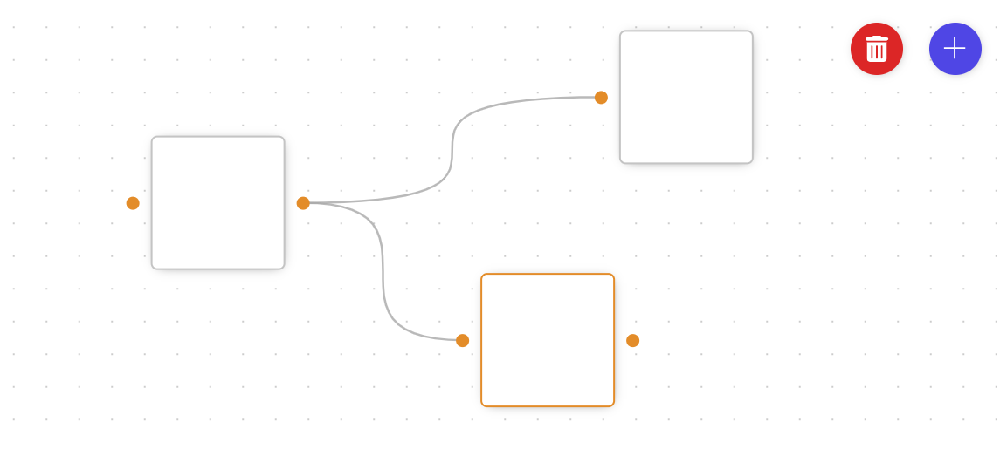

# Node based flow editor

This is a node based flow editor based on the tutorial [Build a Node Based Flow Editor From Scratch!](https://www.youtube.com/watch?v=1JNbGf8dhAQ&t=3045s&ab_channel=Timegame) by [Timegame](https://www.youtube.com/watch?v=1JNbGf8dhAQ&t=3045s&ab_channel=Timegame). Code has been ported from Solid.js to Angular 17.2  (Angular is slower....)

